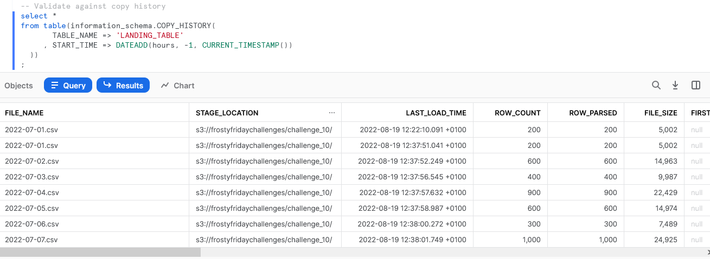
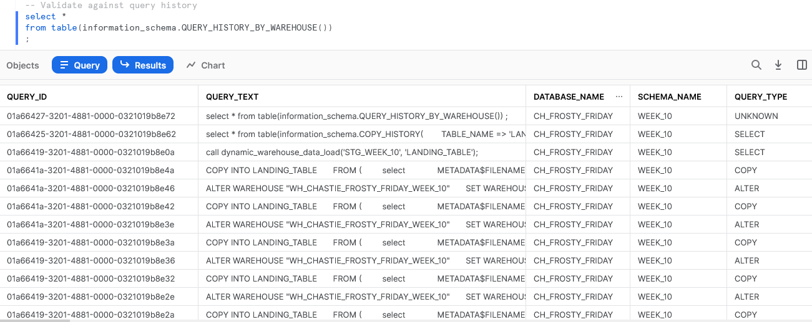

# Frosty Friday - Week 10 - Hard - Stored Procedures

Unfortunately, challenge 10 was not fully possible using Python Stored Procedures. The requirement was to change warehouses based on the file size, and Python Stored Procedures currently do not support changing warehouse or `USE WAREHOUSE` commands.

I only discovered this limitation when I had nearly finished the challenge. Instead of rewriting my solution in another language, I simply tweaked the challenge to resize the warehouse instead.

## Images for Evidence

Stored procedure result:

Copy history:

Query history:

