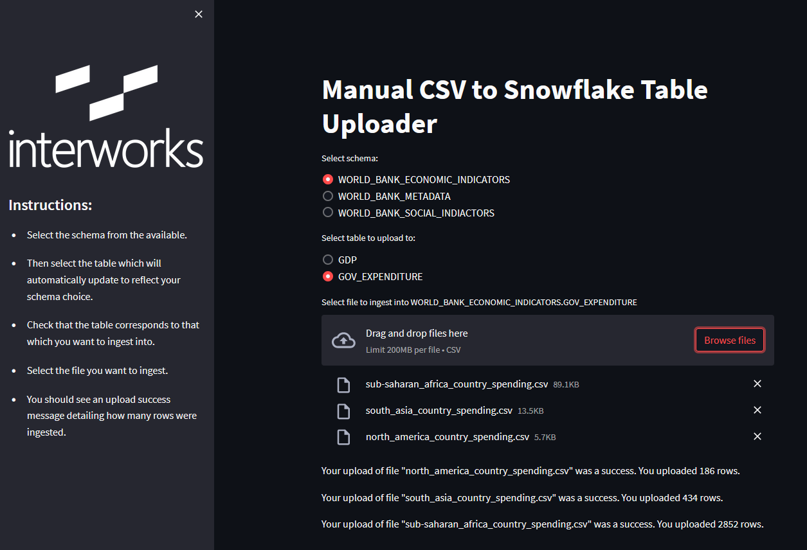

# Frosty Friday Week 12 - Intermediate - Streamlit

## Installing Snowpark and Streamlit via Anaconda

In a Conda prompt, I have executed the following commands. You may wish to change some details depending on your preferences for environment names and file paths.

Create the Anaconda-based Python environment:

```PS
conda create --name py38_snowpark_streamlit python=3.8
```

Install the required Python packages into the new environment:

```PS
conda install --name py38_snowpark_streamlit --file ".\requirements.txt"
```

Activate the environment and test Streamlit:

```PS
activate py38_snowpark_streamlit
streamlit hello
```

Activate the environment and execute our Streamlit code:

```PS
activate py38_snowpark_streamlit
cd path/to/frosty_friday_repo
python -m streamlit run "Week 12 - Intermediate - Streamlit\week_12__Intermediate__streamlit.py"
```

Further details on leveraging Snowpark can be found in the README.md file within the shared/snowpark subdirectory of this repository.

## Final Output

The final output when running Streamlit looks like this.


