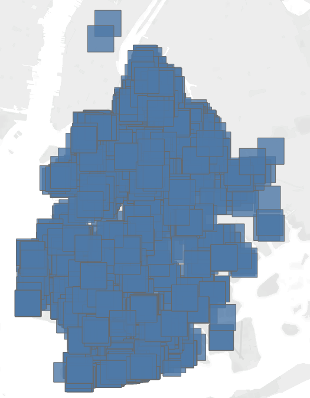
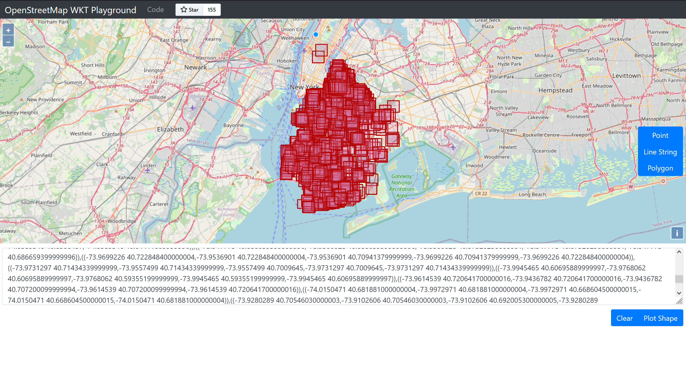

# Frosty Friday Week 17 - Intermediate - Spatial

## Challenge

Full challenge details can be found [here](https://frostyfriday.org/2022/10/07/week-17-intermediate/).

## SQL

All SQL commands for this challenge can be found in a single `.sql` file in this subdirectory.

## Final Outputs

The final output when plotted in Tableau looks like this:

The final output when plotted in [OpenStreetMap WKT Playground](https://clydedacruz.github.io/openstreetmap-wkt-playground/) looks like this:

## Disclaimer

Both of these outputs have excluded an erroneous result in Chaumont. I do not know why this has been tagged in the data as part of Brooklyn.
