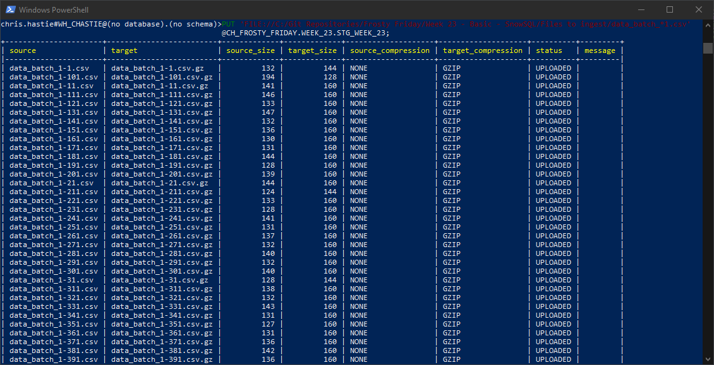
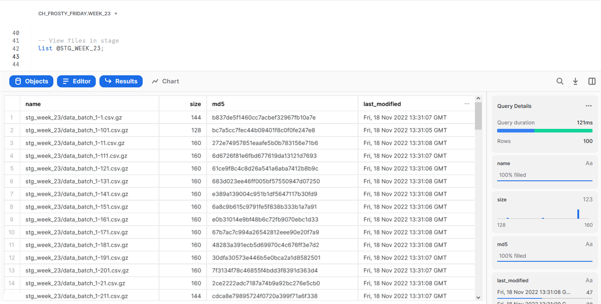

# Frosty Friday Week 23 - Basic - SnowSQL

The original challenge can be found [here](https://frostyfriday.org/2022/11/18/week-23-basic/).

## Files to Ingest

The files to ingest have not been included in the repo to reduce the size. The files can be downloaded [here](https://frostyfridaychallenges.s3.eu-west-1.amazonaws.com/challenge_23/splitcsv-c18c2b43-ca57-4e6e-8d95-f2a689335892-results.zip) and should be unzipped and stored in the `Files to ingest` subdirectory.

## SQL Script

The core of my solution sits within the SQL script `Week 23 - Basic - SnowSQL.sql`, including a commented out section where we leverage SnowSQL to bulk ingest the files.

## SnowSQL

I executed the following commands in SnowSQL:

```ps
snowsql -a my.account -u my_user -r my_role --private-key-path "path\to\my\ssh\key.p8"
PUT 'FILE://C:/My/Path/To/Files to ingest/data_batch_*1.csv' @CH_FROSTY_FRIDAY.WEEK_23.STG_WEEK_23;
```

Here is a screenshot of part of the output:



## Final List Results

After ingesting the files in SnowSQL, we can see the ingested files with a `LIST` command:


