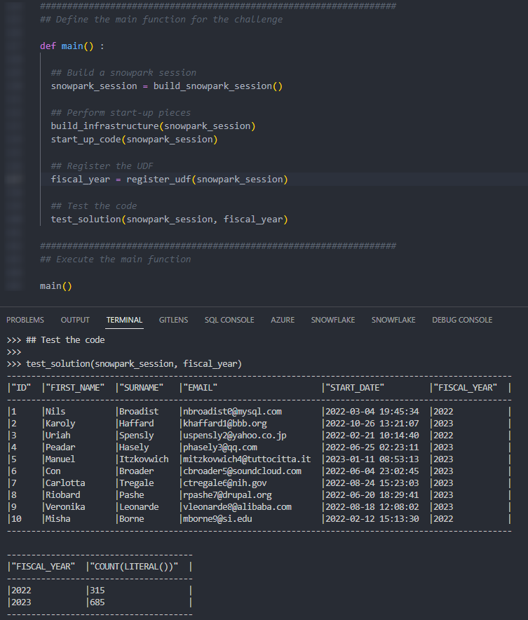

# Frosty Friday Week 29 - Intermediate - Registering UDFs

The original challenge can be found [here](https://frostyfriday.org/2023/01/13/week-29-intermediate/).

## InterWorks Snowpark for Python

To simplify creating Snowpark sessions for the enclosed Python scripts, a custom module called "interworks_snowpark" has been used. More details can be found in the "interworks_snowpark" subdirectory. This subdirectory also contains instructions on how to configure your local environment for Snowpark for Python, along with how you can leverage `conda_requirements.yml` or `requirements.txt` files.

## Final Output

The final output executing the main function looks like this.

