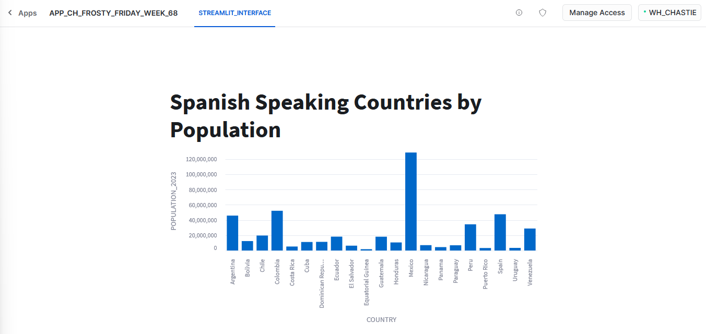

# Frosty Friday Week 68 - Intermediate - Streamlit in Snowflake

The original challenge can be found [here](https://frostyfriday.org/blog/2023/10/20/week-68-intermediate/).

## Deployment

To deploy this solution to your own environment, leverage the following files in the `deployment_files` subdirectory:

- `0 - preparation.sql` - Leverages the standard role for Frosty Friday challenges to create the file format and stage that contains the files for the application
- `1 - deployment.sql` - Leverages an elevated APPLICATION_ADMIN role to deploy the application package and the native application

## Deployed Appearance

Once deployed, the application should appear in Snowflake similar to the following image:

