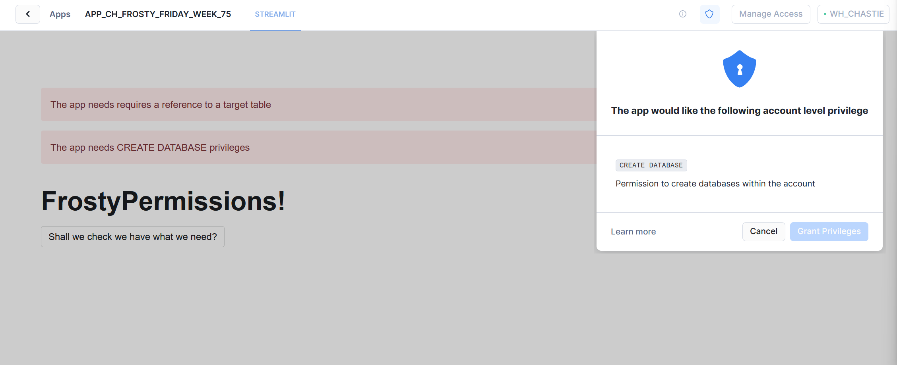
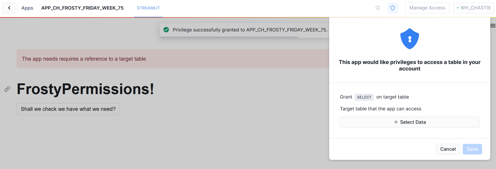
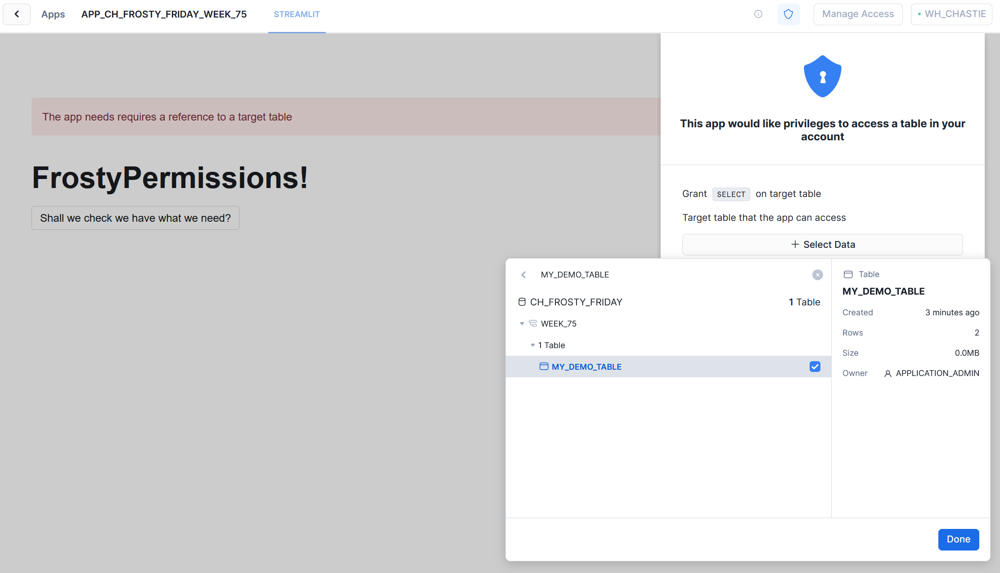
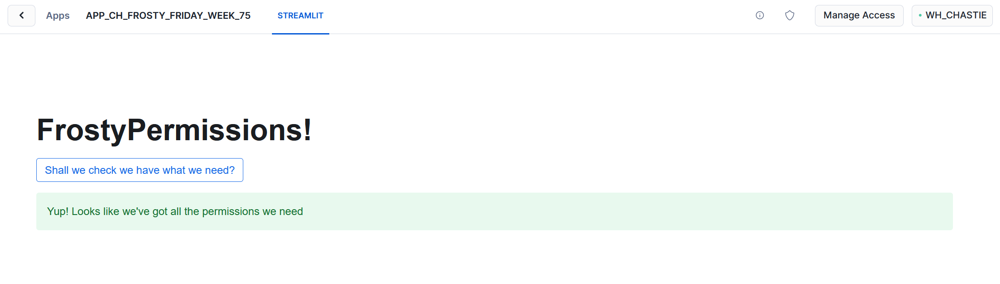

# Frosty Friday Week 75 - Hard - Native App Permissions

The original challenge can be found [here](https://frostyfriday.org/blog/2023/12/15/week-75-hard/).

## Deployment

To deploy this solution to your own environment, leverage the following files in the `deployment_files` subdirectory:

- `0 - preparation.sql` - Leverages the standard role for Frosty Friday challenges to create the file format and stage that contains the files for the application
- `1 - deployment.sql` - Leverages an elevated APPLICATION_ADMIN role to deploy the application package and the native application

## Images

When first loading the app, "CREATE DATABASE" privileges are requested:

Once this is complete, a request is made for select access on the target table:

You can choose the table you desire through the UI:

Finally, we see a successful validation:

