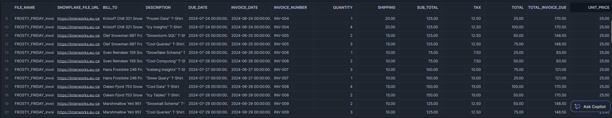

# Frosty Friday Week 99 - Intermediate - Document AI

The original challenge can be found [here](https://frostyfriday.org/blog/2024/06/28/week-99-intermediate/).

## Document AI

The main code for this challenge sits inside the SQL script, however a large portion of the challenge required navigating the relevant pages in the Snowsight UI. These steps are as follows:

1. Create a new build within the Document AI area

    

    After creating the build, the following landing area is shown

    

2. Select the "Upload documents" button to upload the documents that underpin the model

    
    

3. Once uploaded, the number of documents will be reflected in the documents area of the landing page.

    

    The documents will automatically be processed by the default model

    

4. Select "Define values" to begin defining the data to be retrieved from the files

    

    This will show an area where you can enter questions using natural language to retrieve data from the file

    

    When you are happy with your questions, flick through other documents to evaluate the answers and modify your questions

    

5. After defining your values, view them on the "Values" tab. This includes the model's approximation as to its accuracy

    

6. At any point, you can navigate to the "Documents" tab to see the documents and modify any reviewed values

    

7. To improve the accuracy of the model using your reviewed values, train it by selecting "Train model" on the landing page

    

    This will trigger the training of the model. Be warned, this can take a while!

    

    Afterwards, the model will be trained and you should see an improvement in the accuracy.

    

8. If you prefer to publish directly without training, you can also publish directly with "Publish version"

    

9. Once a model is published, some sample queries will be made available for leveraging the model. A version of these queries is used in the SQL script for this challenge.

    

## Final Output

Here is a screenshot of the final output from the SQL script:

