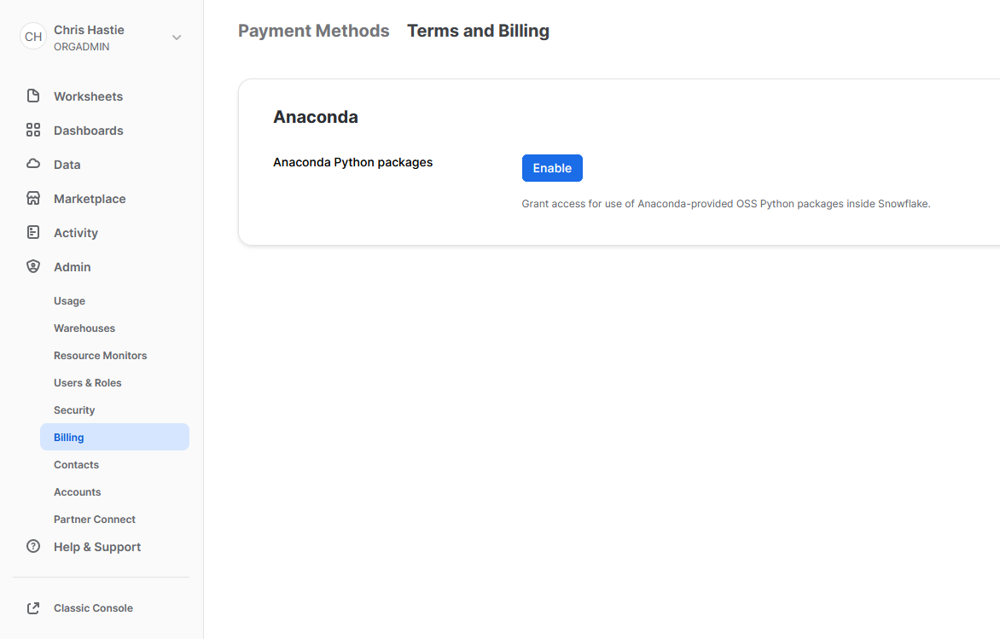
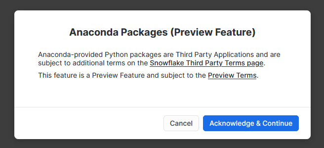
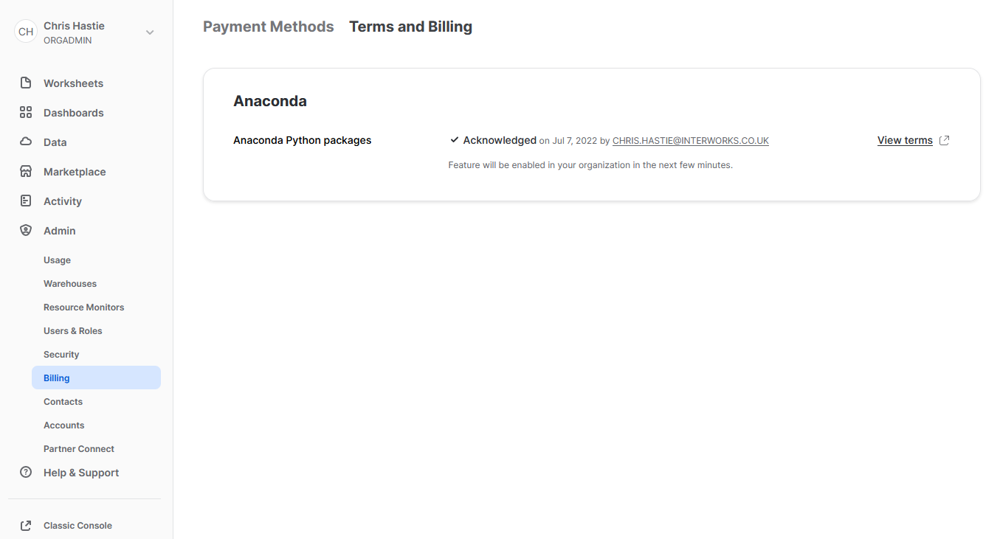

# Snowpark for Python

## Local Installation

To align your local Python environment with a typical Snowpark environment, leverage [Anaconda](https://docs.conda.io/projects/conda/en/latest/user-guide/install/index.html) or [Miniconda](https://docs.conda.io/projects/conda/en/latest/user-guide/install/index.html) and configure an environment with the [Snowflake channel](https://docs.snowflake.com/en/developer-guide/udf/python/udf-python-packages.html#local-development-and-testing).

Snowpark for Python supports [these packages](https://repo.anaconda.com/pkgs/snowflake) which are all part of a single Anaconda channel.

Follow [these steps](https://docs.snowflake.com/en/developer-guide/snowpark/python/setup.html) to set up your development environment.

A shortcut is to simply leverage the following code to create your Anaconda Python environment, using a conda terminal:

```powershell
conda create --name py38_snowpark --file path/to/this/repo/requirements.txt --channel https://repo.anaconda.com/pkgs/snowflake python=3.8
```

Once you have created your environment, you can install additional packages by adapting the following example code, which installs pandas (already included in requirements.txt):

```powershell
conda install --name py38_snowpark --channel https://repo.anaconda.com/pkgs/snowflake pandas
```

This is already included in the requirements file, but for completeness the following code demonstrates how to install the main Snowpark package:

```powershell
conda install --name py38_snowpark --channel https://repo.anaconda.com/pkgs/snowflake snowflake-snowpark-python
```

### Configuring Conda for Visual Studio Code

> Disclaimer: I am using VSCode but other IDEs are available

Configuring Conda to work with Python through VSCode requires you to set up a bespoke terminal profile within your VSCode settings. You can do so by following these steps within VSCode:

1. Open the commands shortcut (`CTRL+SHIFT+P`) and select `Terminal: Select Default Profile`
2. Select the small settings cog to the right of one of the existing PowerShell profiles
3. In the naming window, enter the name "Windows PowerShell Conda" or any other name if you prefer
4. Use the same commands shortcut (`CTRL+SHIFT+P`) and select `Preferences: Open Settings (JSON)`
5. Steps 1-3 will have added a new key to your `settings.json` file called "terminal.integrated.profiles.windows", which lists a set of different terminal profiles. The final entry on this list should be your new profile, which we called "Windows PowerShell Conda". Modify this profile to match the following settings:

    ```json
    "Windows PowerShell Conda": {
        "source": "PowerShell",
        "args": [
            "-NoExit",
            "Path\\to\\conda-hook.ps1"
        ],
        "icon": "terminal-powershell"
    }
    ```

    The desired path to `conda-hook.ps1` depends on where you installed Conda. Usually this will be one of the following two options:

    1. When Conda was installed to the C drive for all users:

        ```raw
        "C:\\ProgramData\\Anaconda3\\shell\\condabin\\conda-hook.ps1"
        ```

    2. When Conda was installed for a single user, where %USERPROFILE% should be expanded out to the full path:

        ```raw
        "%USERPROFILE%\\Anaconda3\\shell\\condabin\\conda-hook.ps1"
        ```

6. Finally, open the commands shortcut (`CTRL+SHIFT+P`) and select `Terminal: Select Default Profile`, then select the new profile as the default. For our example, we would select "Windows PowerShell Conda"

## Connection Parameters

The Python scripts are configured to ingest a snowflake_connection_parameters dictionary and use it to establish connections to Snowflake.

The dictionary may either be provided as a locally stored .json file or as part of a Streamlit secrets .toml file.

If using a locally stored .json file, this file should be created in the root directory as this repository and should match the format below. This is not synced with git (currently in `.gitignore` to avoid security breaches).

```json
{
  "account": "<account>[.<region>][.<cloud provider>]",
  "user": "<username>",
  "default_role" : "<default role>", // Enter "None" if not required
  "default_warehouse" : "<default warehouse>", // Enter "None" if not required
  "default_database" : "<default database>", // Enter "None" if not required
  "default_schema" : "<default schema>", // Enter "None" if not required
  "private_key_path" : "path\\to\\private\\key", // Enter "None" if not required, in which case password will be used
  "private_key_passphrase" : "<passphrase>", // Enter "None" if not required
  "password" : "<password>" // Enter "None" if not required, ignored if private key path is provided
}
```

If using a locally stored streamlit secrets file, this file should be created in a subdirectory called .streamlit within the root directory as this repository and should match the format below. This is not synced with git (currently in `.gitignore` to avoid security breaches).

```toml
[snowflake_connection_parameters]
account = "<account>[.<region>][.<cloud provider>]"
user = "<username>"
default_role = "<default role>" ## Enter "None" if not required
default_warehouse = "<default warehouse>" ## Enter "None" if not required
default_database = "<default database>" ## Enter "None" if not required
default_schema = "<default schema>" ## Enter "None" if not required
private_key_path =  "path\\to\\private\\key" ## Enter "None" if not required, in which case password will be used
private_key_passphrase = "<passphrase>" ## Enter "None" if not required
password = "<password>" ## Enter "None" if not required, ignored if private key path is provided
```

Note that we have included a default role and warehouse here. Unfortunately, at time of writing it appears that Snowpark sessions will leverage your default role in a session without being explicitly told, but it will not leverage a default warehouse unless explicitly told. I find it to be safer and easier to just provide the details of both here, especially if you do not want your Snowpark connection to leverage your Snowflake user's standard default role.

## Third Party Packages from Anaconda

To leverage third party packages from Anaconda within Snowflake, an ORGADMIN must first accept the [third party terms of usage](https://www.snowflake.com/legal/third-party-terms/). More details can be found [here](https://docs.snowflake.com/en/developer-guide/udf/python/udf-python-packages.html#using-third-party-packages-from-anaconda). This only needs to be enabled once for the entire organisation.

1. Using the ORGADMIN role in the SnowSight UI, navigate to `Admin` > `Billing` to accept the third party terms of usage

    

2. Confirm acknowledgement

    

3. The screen will then update to reflect the accepted terms

    
